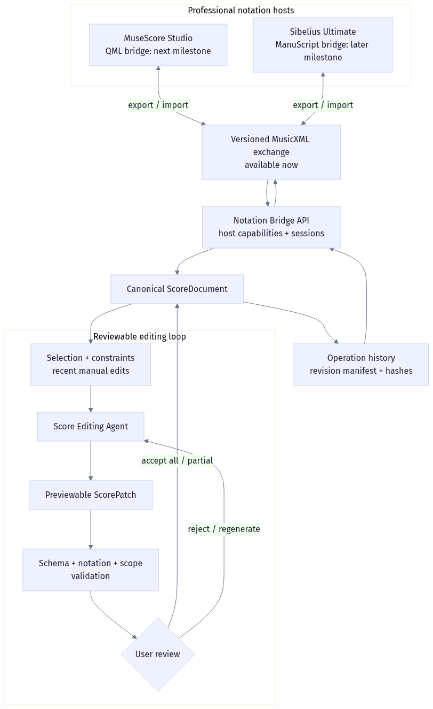

# Sera 智能乐谱编辑与协作层开发路线图

## 新定位

Sera 不再以“从文本生成整首乐谱”或“在应用内重造专业记谱软件”为首要目标。新的产品定义是：

> Sera 是建立在专业记谱环境之上的智能音乐编辑与协作层。

主工作流固定为：

```text
MuseScore / Sibelius 中的现有乐谱
  -> 导入或同步到 canonical ScoreDocument
  -> 用户选择段落并输入编辑提示词
  -> Agent 生成可预览 ScorePatch
  -> 范围、记谱、音乐与约束校验
  -> 用户全部接受、部分接受、拒绝或重生成
  -> 写出新修订并回到专业记谱软件
```

旧整曲生成、候选生成、模型训练与内置重型编辑器暂不删除，避免破坏已有工作；它们进入 `legacy compatibility` 状态，默认 UI 隐藏，不再获得新功能投入。

## 保留、冻结与新增

| 类别 | 决策 | 原因 |
|---|---|---|
| `ScoreDocument` | 保留并强化 | 外部交换、Agent 编辑、验证、撤销和审计的唯一事实源 |
| `ScoreOperation` / `ScorePatch` | 保留并强化 | 把自然语言意图转换为可审查、可部分接受、可回滚的结构化编辑 |
| MusicXML 导入/导出 | 升格为核心 | MuseScore 与 Sibelius 之间最现实的 V1 互操作边界 |
| 记谱与一致性校验 | 保留并强化 | 防止 Agent 产生越界或不可导出的编辑 |
| Workbench | 收敛为检查与协作界面 | 不与专业记谱软件争夺完整排版和输入体验 |
| 整曲生成/模型实验 | 冻结为兼容层 | 当前价值低于编辑闭环，不再作为默认入口 |
| MuseScore QML / Sibelius ManuScript 适配器 | 新增 | 从手工文件交换逐步升级到宿主内 Agent 工作流 |
| 协作审阅、评论、修订合并 | 新增 | 支持作曲家、编曲者、教师、演奏者之间的可追踪协作 |

## 架构原则

1. `ScoreDocument` 是 canonical source of truth，预览、播放、导出和 Agent 上下文不得绕开它。
2. Agent 只产生 `ScorePatch`，不能直接静默覆盖当前乐谱。
3. 每个补丁必须带目标范围、理由、预期效果、约束对齐和风险提示。
4. 应用补丁前运行 schema、选区边界、MusicXML、节拍/时值与保留约束校验。
5. 外部宿主原文件永不覆盖；每次回写生成带 revision 的新文件。
6. 会话保存 SHA-256、revision 和 artifact 清单；过期客户端回写返回冲突。
7. 宿主特定能力通过 adapter 暴露；未验证的 QML/ManuScript 功能不得标为可用。

架构源文件：[`docs/architecture/sera_notation_editing_layer.mmd`](architecture/sera_notation_editing_layer.mmd)。



## 分阶段计划

### M0：编辑核心盘点与产品切换（已完成）

- 默认进入 Workbench。
- 隐藏整曲生成、候选评估和模型页；保留环境变量兼容开关。
- 更新产品名称、API contract、README 与 Agent 开发契约。
- 验收：无生成结果时仍能创建空白 `ScoreDocument`，能导入乐谱并执行提示词编辑。

### M1：MusicXML 记谱桥（已完成）

- 建立 `NotationHostAdapter` 契约。
- 支持 `musescore`、`sibelius`、`musicxml` 三种宿主描述。
- 创建 bridge session，保存 source artifact、哈希和 revision 0。
- 通过 `expected_revision` 导出 revision 1、2……，拒绝覆盖和过期写入。
- 前端显示宿主、会话、修订与真实能力状态。
- 验收：导入 -> Agent patch -> 接受 -> 导出新 MusicXML 修订；原文件字节不变。

### M2：MuseScore Studio QML 插件（进行中）

- M2a 已实现薄桥接 artifact：`integrations/musescore/SeraBridge/SeraBridge.qml`。
- 插件提取当前 range selection 上下文、导出系统临时 MusicXML，并调用 Electron 桌面应用拥有的 localhost Sera API；不打开外部浏览器。
- Electron 轮询安全的 session 通知通道，自动置前窗口；Workbench 从 session 恢复 canonical `ScoreDocument` 与宿主选区。导出后插件可把最新 revision 作为 MuseScore 新标签页打开。
- QML 不包含 API key，不接收任意本地路径，不覆盖当前乐谱，也不宣称原位应用。
- M2a 自动验收：QML 静态合同、桥接 API、Electron IPC、revision artifact、Workbench session 恢复和非破坏式回传全部可在无 MuseScore 环境测试。
- M2b 待真实 MuseScore：原位 patch、一次 undo transaction、复杂 selection/element ID 映射与失败回滚。
- M2 最终验收仍为：在 MuseScore 中选 2 小节，提示“保持和声，简化节奏”，原位预览应用后一次撤销可恢复。

### M3：Sibelius Ultimate ManuScript 插件

- 使用 ManuScript 获取活动乐谱与选区并导出 MusicXML。
- 通过安全的本地交换目录或 helper process 与 Sera 通信。
- 把 Sera patch 映射回 ManuScript 可支持的对象操作；不支持的记谱元素回退为新 MusicXML 修订。
- 验收：Sibelius 中的选区、谱表、声部和小节范围与 Sera patch 精确一致，失败不修改原谱。

### M4：专业编辑 Agent 能力

- 把当前宽泛 mock fallback 拆成可组合技能：节奏简化、移调、配器/织体、和声重配、声部整理、演奏性检查、记谱清理。
- 增加 `explain -> plan -> patch -> validate -> revise` 多步 Agent 状态机。
- 为每种操作定义可执行 schema、最大改动范围和保留规则。
- 验收：典型提示词在无 LLM 时给出安全 no-op/受限回退，有 LLM 时仍通过确定性验证层。

### M5：协作与审阅

- Patch 评论、作者身份、本地分支、审阅状态、冲突解决和修订比较。
- 支持导出包含 `ScoreDocument + Patch history + comments + validation` 的 `.sera.json` 协作包。
- 后续再评估实时多人同步；V1 不引入账户或云服务。
- 验收：两位编辑者的非重叠 patch 可合并，重叠 patch 必须显式解决冲突。

## 当前 API

```text
GET  /integrations/notation-hosts
GET  /integrations/desktop/status
GET  /integrations/desktop/pending-session
POST /integrations/notation-sessions
GET  /integrations/notation-sessions/{session_id}
GET  /integrations/notation-sessions/{session_id}/workspace
GET  /integrations/notation-sessions/{session_id}/artifacts/{revision}
POST /integrations/notation-sessions/{session_id}/export

POST /score/agent_edit
POST /score/preview_patch
POST /score/validate_patch
POST /score/apply_patch
POST /score/partial_apply_patch
POST /score/reject_patch
POST /score/undo
POST /score/redo
```

## 风险与边界

- MusicXML 是交换格式，不保证保留宿主全部专有排版、播放和插件元数据。
- MuseScore QML 与 Sibelius ManuScript 的对象模型不同，不能假设同一组低层操作可以无损映射。
- M2a QML artifact 与本地 API 已实现，但“真实 MuseScore 可加载并完成回传”仍需实际软件安装与插件烟测。
- 不允许 Agent 在没有用户确认时写回宿主文件。
- 不允许通过 HTTP 接口读取任意本地路径；当前接口接收用户明确上传的 MusicXML 文本。

## 官方技术依据

- MuseScore Studio 官方手册说明插件需要安装并启用，4.x 插件使用其扩展/插件 API；命令行也支持打开、转换和运行插件。
- Avid 官方 ManuScript 指南把 ManuScript 定义为 Sibelius Ultimate 的插件语言，并提供 `Score`、`Staff`、`Bar`、`NoteRest` 等乐谱对象。
- 因此路线选择为：先用 MusicXML 获得跨宿主、可测试的共同边界，再分别开发 QML 与 ManuScript 薄适配器。
