# SeraEdit: Reliable Language-Guided MusicXML Editing through Structured Score Patches

**Yuan Gao**

**Zhejiang Conservatory of Music, No. 1 Zheyin Road, Zhuantang Street, Xihu District, Hangzhou, Zhejiang Province, China 310024**

**Corresponding author:** selanceg@gmail.com

**ORCID:** 0009-0005-0394-3623

## Abstract

SeraEdit is local-first research software for reliable language-guided editing of
symbolic scores. Rather than asking a language model to rewrite an entire MusicXML
document, it represents a request as a versioned ScorePatch bound to stable event
identifiers, target and protected scopes, and a source fingerprint. Layered validators
check schema, score structure, duration, notation relations, protected content, and
MusicXML round-trip fidelity inside an atomic transaction. A desktop interface and
MuseScore bridge expose proposals, diffs, rejection reasons, and undo without silently
overwriting the host score. The release includes 20 synthetic scores, 120 editing
tasks, three evaluation conditions, resumable experiment tooling, and offline fixtures
for reproducible software verification.

Keywords: MusicXML; symbolic music; score editing; structured patches; validation; research software

## 1. Motivation and significance

MusicXML is a widely used interchange representation for common Western music
notation, allowing scores to move among notation, analysis, engraving, and archival
systems [1]. Natural-language interfaces could reduce the mechanical cost of local
edits such as transposition, dynamics, articulation, or voice assignment. However,
the obvious implementation—send a complete MusicXML document to a generative model
and accept a complete rewrite—mixes the intended change with thousands of unrelated
elements. A syntactically well-formed response can still alter an unselected staff,
break a tie, change measure duration, or drift from the source that the user reviewed.

Existing symbolic-music toolkits provide rich programmatic analysis and generation
facilities [2,3], while recent work investigates music reasoning and generation with
large language models [4,5]. SeraEdit addresses a narrower systems problem: how to make
a language-guided edit inspectable, source-bound, minimal, and rejectable before it is
returned to a professional notation environment. The core research object is therefore
not a generated score but a transaction over a canonical score representation.

The software supports research into constrained generation, deterministic evaluation
of editing agents, error taxonomies, repair policies, and human-in-the-loop notation
workflows. Stable task fixtures and three separately implemented experimental conditions
allow investigators to compare full-document rewriting, unprotected structured patches,
and a fully validated transaction without changing the source score or metric code.
This separation is analogous to structured editing evaluations in programming-language
research [6], but the invariants include exact musical time, voices, and notation
relations. Citation and archival metadata follow established software-citation
principles [7].

## 2. Software description

### 2.1. Software architecture

Figure 1 summarizes the local pipeline. A MusicXML snapshot is imported into one
canonical `ScoreDocument`. Editable events receive stable identifiers, while a
canonical SHA-256 fingerprint identifies the exact source state. The renderer,
preview, patch executor, MIDI conversion, and exporter consume this same document;
the research pipeline does not maintain a hidden second score for playback or export.

**Figure 1.** The notation host remains the visual source. SeraEdit produces a separate
reviewed MusicXML revision or rejects the transaction while retaining the source.

### 2.2. Software functionalities

A `ScoreScope` deterministically selects measures, parts, staves, voices, event IDs,
and optional time ranges. Each patch declares a target scope, a protected scope, and
explicit exclusions. Its operations use a versioned JSON schema and describe selectors,
arguments, preconditions, and expected change counts. Implemented research operations
include pitch and duration changes, event insertion/deletion, dynamics, articulations,
ties, slurs, signature changes, voice moves, motif duplication, chord replacement,
and transactional batches. The product interface enables only operations whose host
round-trip contract is established; unknown operations fail as unsupported rather than
becoming silent no-ops.

Applying a patch is a transaction: validate the source fingerprint and schema; resolve
selectors and preconditions; clone the score; apply operations; validate structure,
exact measure duration, notation relations, semantic constraints, and protected scope;
export/re-import MusicXML; then commit or roll back. The result includes machine-readable
errors, a human-readable diff, fingerprints, and before/after snapshots for undo/redo.
Deterministic repair is limited to transparent formatting or enum normalization. An
optional model repair is bounded by a configurable attempt count and receives the
validation errors and immutable scopes; it cannot bypass the transaction.

Provider adapters share a response contract recording model, latency, token use,
estimated cost, request ID, finish reason, raw output, parsed output, and normalized
errors. API keys are external to source and experiment artifacts. The desktop agent can
respond locally first and refine a high-level plan asynchronously with an optional LLM,
so provider latency does not block access to local safe candidates. Neither response is
auto-applied.

The evaluation subsystem implements three conditions. `full_rewrite` accepts a complete
MusicXML response without protected-scope repair. `patch_only` parses and basically
applies a structured patch without the full safety pipeline. `sera_full` enables source
fingerprints, scopes, layered validation, bounded repair/refusal, atomic apply, undo, and
round-trip checks. Runs have immutable IDs, configuration and prompt hashes, retry and
cost limits, caching, resumability, raw outputs, normalized outputs, and deterministic
metric recomputation.

## 3. Illustrative examples

Consider the instruction: “Transpose measures 1–2 of staff 1 up two semitones and
preserve rhythm; leave staff 2 unchanged.” SeraEdit binds the candidate to the imported
fingerprint and resolves only pitched events in measures 1–2, staff 1. Preview applies
the transposition to a clone. Duration equality is checked with rational values, staff
2 is compared event-by-event as protected content, and the exported MusicXML must parse,
import, export, and parse again. A valid preview reports the exact changed event count;
a stale fingerprint, missing event, duration change, or difference on staff 2 rejects
and rolls back the whole patch.

The same workflow is available through the desktop interface or an optional MuseScore
Studio 4 bridge. The bridge exports a temporary snapshot and selection context to the
local Sera process. After proposal review, the bridge opens a separate reviewed revision
in MuseScore. This is deliberately not described as in-place control of MuseScore's
internal document: the original open score is not overwritten, and final visual review
and saving remain user actions.

For offline verification, the repository contains 20 short CC0 synthetic scores and
120 tasks spanning transposition, rhythm, harmony/key, voice/texture, dynamics,
insertion/deletion, ties/slurs, meter, compound edits, and expected refusal. Tasks carry
target/protected scope and deterministic expected constraints. The fixture provider
returns known outputs to exercise all runner and metric paths without network access or
token cost.

For review, `scripts/run_reviewer_demo.py` runs six representative tasks through the
actual local product entry point and writes a compact evidence report plus five
host-openable MusicXML revisions (the sixth task is an expected refusal). It requires
neither an API key nor a network connection. The included Windows CI workflow repeats
the Python regression suite, benchmark validation, this reviewer demo, package audit,
frontend tests, and production build on each push or pull request.

On Windows 11 (build 10.0.26200), Python 3.12.5, Node.js 24.16.0, and npm 11.13.0,
the 2026-08-27 verification produced the following results. Automatic benchmark
validation accepted 120/120 task definitions. Human inspection then completed 120/120
current primary decisions and a stratified 30/30 repeat check with zero stale records;
all current decisions were compliant after the correction cycle. The append-only export
retains 194 records, including superseded revision findings. Both passes used the same
pseudonymous reviewer, so these data verify task instructions, scopes, Gold outputs,
and host-visible notation but do not measure inter-rater reliability. The Python suite
collected and passed 408 tests. Vitest passed 120 tests in 72 files, the Vite production
build transformed 216 modules, and staged
backend, compatibility launcher, and Electron desktop runtime smoke checks passed.
The fresh `softwarex_verification_120_v1` fixture run completed all 360 expected
task-condition cases with zero execution errors. Its verifier confirmed matching
configuration, benchmark, prompt, dependency and metric evidence. These are software
verification results, not evidence that a language model achieves perfect edits; the
experiment manifest explicitly sets `formal_results_allowed` to false.

We additionally replayed every benchmark instruction through the interactive product
entry point without supplying its Gold patch to generation. Across English and Chinese
instructions and three independent repetitions, 720/720 runs completed generation or
the expected refusal, transaction preview, atomic commit, protected-scope checking,
deterministic constraints, and MusicXML export/re-import. All 660 executable runs
produced valid MusicXML; 60 conflict runs refused safely; no unsafe execution occurred.
Patch and result fingerprints were identical in all 240 repeated task-language groups.
After correcting a Chinese `preserve pitch`/tenuto ambiguity exposed by cross-language
comparison, all 120 task groups also produced semantically equivalent patches and
identical final score fingerprints across English and Chinese.
The compact publication snapshot retains all run metrics and hashes for all 1,380 raw
and host evidence files, plus 220 host-openable outputs for complete task review. This
establishes deterministic product-path acceptance,
not remote-LLM accuracy or human musical quality.

We separately tested localization when the notation host supplied a wider selection
than the measure named in the instruction. The robustness runner added one adjacent
measure to each eligible explicit-measure request. It passed 240/240 bilingual runs;
expansion was applicable in 174 runs, and all 174 retained the intended task result,
protected content, and valid MusicXML. The remaining 66 tasks were not widened because
the instruction did not name a specific measure, the source lacked an adjacent measure,
or the operation was global. This regression set directly tests host-selection versus
semantic-target resolution and remains deterministic product evidence, not model accuracy.

| Evidence layer | Scale | Verified result | Claim boundary |
| --- | ---: | --- | --- |
| Benchmark definition | 120 tasks / 20 scores | 120/120 valid | Schema, Gold application, constraints, round trip |
| Automated regression | 408 Python; 120 frontend | All passed | Software behavior on the tested environment |
| Reviewer demo | 6 representative tasks | 6/6 passed; five host files | Offline product-path reproducibility |
| Product replay | 720 bilingual runs | 720/720; 660 host exports | Deterministic local generator, not remote-LLM accuracy |
| Wider host selection | 240 bilingual runs | 240/240; 174 widened | Semantic target remains narrower than authorization |
| Human task review | 120 primary + 30 repeat | Complete; zero stale | Same reviewer; no inter-rater or aesthetic claim |

## 4. Impact

SeraEdit makes failure observable and reusable as research data. A rejected request is
classified by stage—for example malformed patch, invalid selector, duration mismatch,
broken relation, protected-scope violation, incomplete execution, over-editing, conflict,
unsupported operation, or provider timeout—instead of being reduced to an application
error. Raw outputs and post-hoc deterministic metrics support studies of which safeguards
contribute to validity, task completion, non-target preservation, minimality, repair,
and refusal behavior.

The software also lowers the cost of building controlled symbolic-editing experiments.
Researchers can add public-domain fixtures and task constraints without creating a new
front end, provider wrapper, transaction engine, or reporting pipeline. The mock path
supports continuous integration, classrooms, and reproducibility checks, while API-backed
runs remain clearly separated. A local desktop and MusicXML bridge make the same research
contracts inspectable by composers and notation users rather than only by programmers.

Potential reuse extends beyond music: source fingerprinting, explicit editable/protected
regions, typed operations, deterministic validators, and atomic rollback are applicable
to language-guided editing of other structured scientific documents. Within music, the
architecture provides a foundation for more rigorous human studies of interaction and
musical quality without treating a model's output as ground truth.

Current evidence supports reliability engineering, human-checked benchmark semantics,
and reproducible experiment execution, not universal musical correctness or aesthetic
improvement. The fixtures are small and synthetic, and the repeated check was performed
by the same reviewer rather than an independent panel. The canonical importer is strongest
for common short MusicXML passages and does not establish universal handling of tuplets,
grace relations, complex cross-voice notation, or every notation application. MuseScore
has an exercised bridge; Sibelius interoperability is not yet verified. Live-provider
quality, latency, and cost can change with model versions and networks. Structural
orchestration and unrestricted composition remain outside the host-safe contract.

## 5. Conclusions

SeraEdit packages language-guided MusicXML editing as a source-bound, scoped, validated,
and reversible transaction. Its principal contribution is an executable reliability
boundary: the model proposes, while canonical score state, deterministic validators,
protected-scope comparison, MusicXML round trips, and user review decide whether a
revision exists. The open-source release includes a desktop demonstration,
host bridge, benchmark, three evaluation conditions, automated metrics, tests, and
reproducibility tooling. Future releases will prioritize formal model comparisons,
cross-host testing, richer exact notation relations, and independent blinded musician
evaluation rather than weakening transaction safeguards.

## Code metadata

| Nr. | Code metadata description | Metadata |
| --- | --- | --- |
| C1 | Current code version | `1.0.0` |
| C2 | Permanent link to code/repository used for this code version | `https://github.com/Selancee/Sera/releases/tag/v1.0.0` |
| C3 | Permanent link to reproducible capsule | `https://doi.org/10.5281/zenodo.22128976` |
| C4 | Legal code license | MIT; benchmark data CC0-1.0 |
| C5 | Code versioning system used | Git |
| C6 | Software code languages, tools and services used | Python, TypeScript/JavaScript, React, FastAPI, Electron, QML, PowerShell, MusicXML |
| C7 | Compilation requirements, operating environments and dependencies | Python >=3.10; Node.js/npm for interface development; Windows 10/11 desktop; requirements, tested Windows constraints, and npm lock files |
| C8 | Developer documentation/manual | `docs/softwarex/API_REFERENCE.md`, `INSTALLATION.md`, `USER_MANUAL.md`, `REVIEWER_GUIDE.md`, and generated OpenAPI `/docs` |
| C9 | Support email for questions | `selanceg@gmail.com` |

## Software metadata

| Nr. | Software metadata description | Metadata |
| --- | --- | --- |
| S1 | Current executable software version | `1.0.0` |
| S2 | Permanent link to executable | `https://github.com/Selancee/Sera/releases/download/v1.0.0/Sera-1.0.0-x64.exe` |
| S3 | Permanent link to reproducible capsule | `https://doi.org/10.5281/zenodo.22128976` |
| S4 | Legal software license | MIT |
| S5 | Computing platforms/operating systems | Windows 10/11 x64; source-level core also uses Python >=3.10 |
| S6 | Installation requirements and dependencies | See `docs/softwarex/INSTALLATION.md` |
| S7 | User manual | `docs/softwarex/USER_MANUAL.md` |
| S8 | Support email | `selanceg@gmail.com` |

## Author contributions

`Yuan Gao: Conceptualization, Methodology, Software, Validation, Investigation,
Data curation, Writing – original draft, Writing – review & editing, Visualization.`

## Funding

This research did not receive any specific grant from funding agencies in the public,
commercial, or not-for-profit sectors.

## Declaration of competing interest

The author declares that there are no known competing financial interests or personal
relationships that could have appeared to influence the work reported in this paper.

## Data and code availability

Source code, synthetic benchmark data, test fixtures, evaluation configuration, and
the non-formal verification run are available from the tagged public repository in
C2. Zenodo has reserved `10.5281/zenodo.22128976` for the versioned deposit in C3;
public DOI resolution begins when the corresponding author publishes that deposit.
No API key is distributed.

## References

[1] M. Good (Ed.), MusicXML 4.0, W3C Music Notation Community Group Final Report, 2021.  
[2] M. S. Cuthbert, C. Ariza, music21: A toolkit for computer-aided musicology and symbolic music data, ISMIR, 2010, 637–642.  
[3] C. Raffel, D. P. W. Ellis, Intuitive analysis, creation and manipulation of MIDI data with pretty_midi, ISMIR Late-Breaking/Demo, 2014.  
[4] R. Yuan et al., ChatMusician: Understanding and generating music intrinsically with LLM, Findings of ACL, 2024.  
[5] Z. Zhou et al., Can LLMs “reason” in music? An evaluation of LLMs' capability of music understanding and generation, ISMIR, 2024.  
[6] J. Guo et al., CodeEditorBench: Evaluating code editing capability of large language models, arXiv:2404.03543, 2024.  
[7] A. M. Smith, D. S. Katz, K. E. Niemeyer, FORCE11 Software Citation Working Group, Software citation principles, PeerJ Computer Science 2 (2016) e86. https://doi.org/10.7717/peerj-cs.86.
